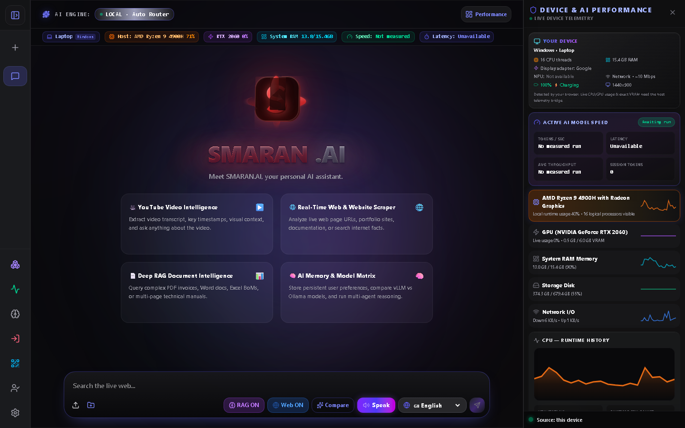
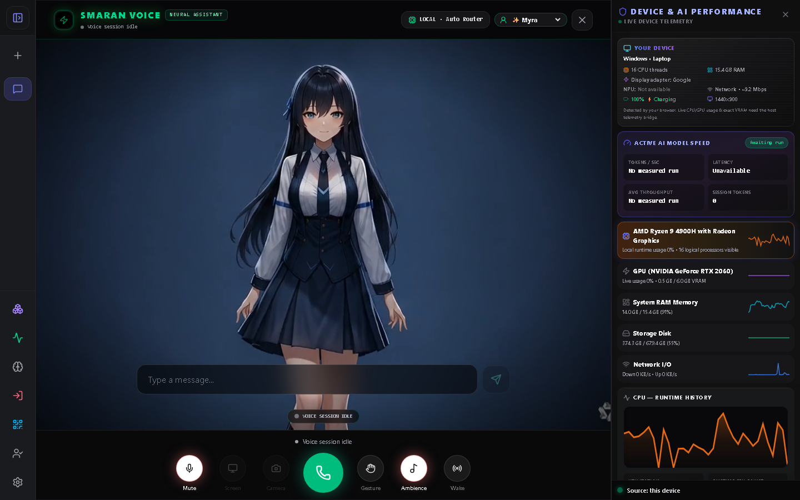
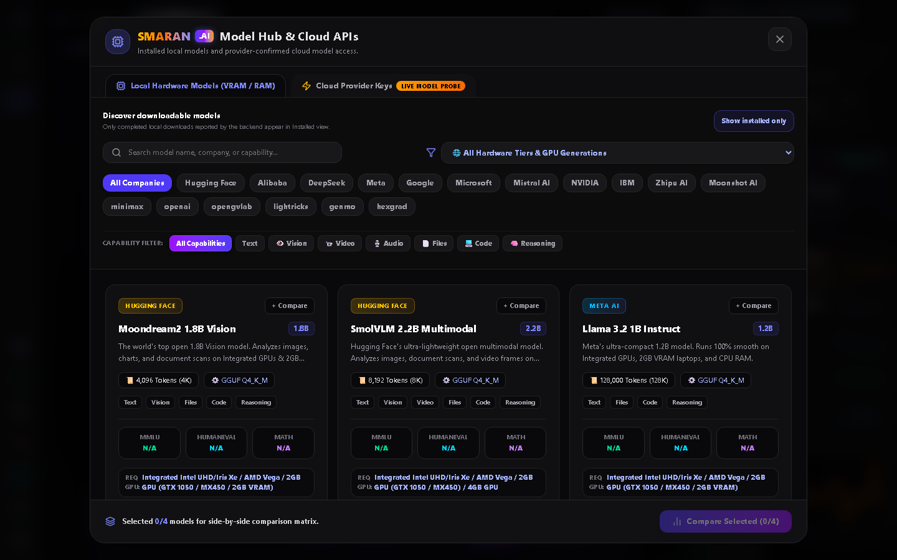
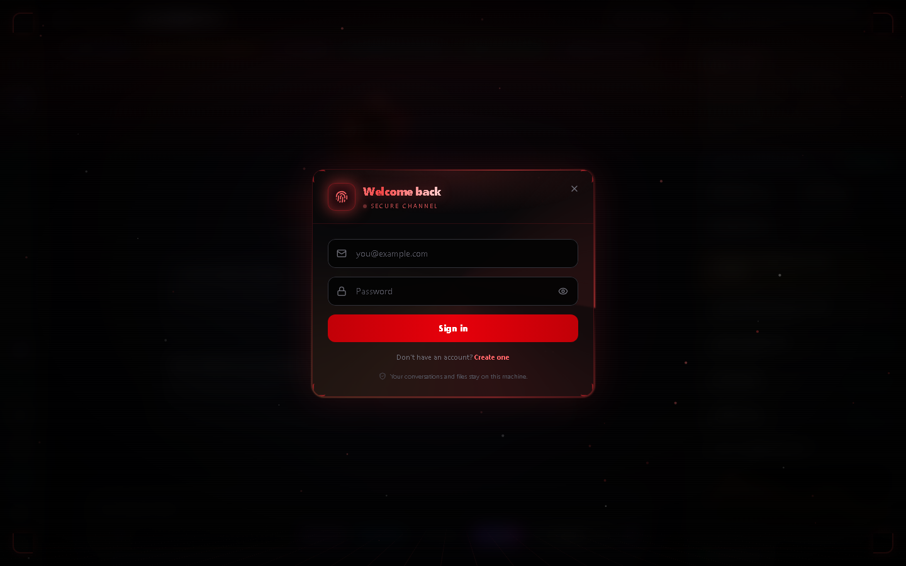
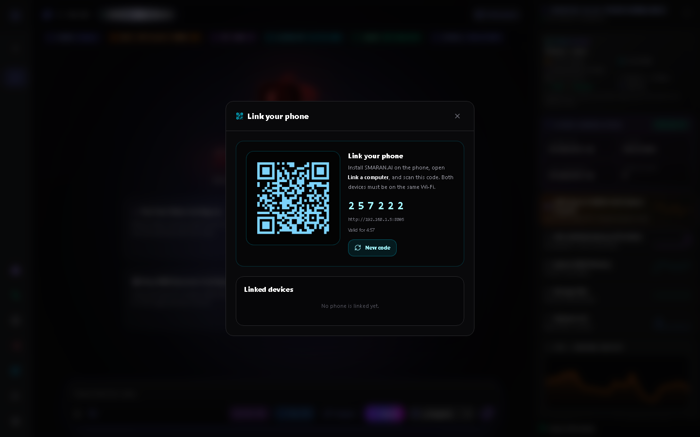
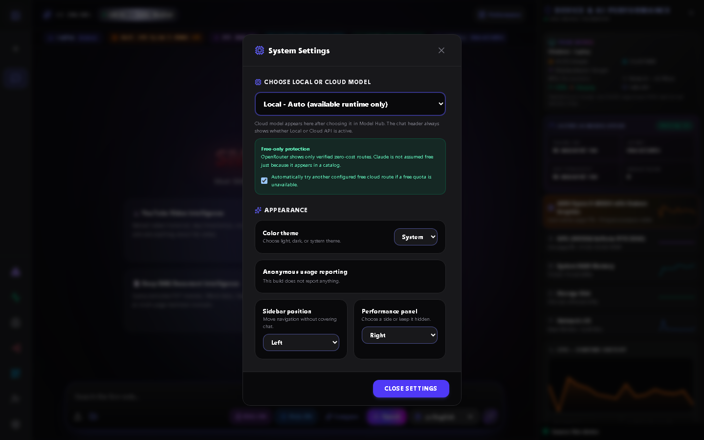
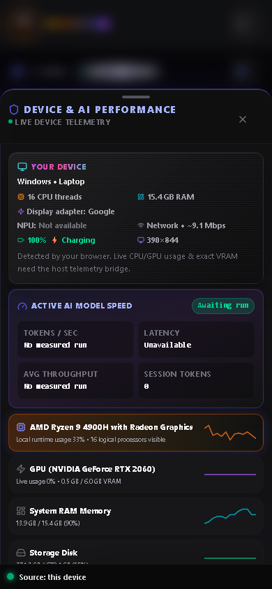

<div align="center">


# SMARAN.AI 2.8.2

**A local-first AI workspace.** Chat, voice, vision and your own documents,
running on your own machine.

[](https://github.com/SHASHWAT-MISHRA-997/SMARAN.AI/releases/latest/download/SMARAN.AI-Setup.exe)
[](https://github.com/SHASHWAT-MISHRA-997/SMARAN.AI/releases/latest/download/SMARAN.AI.apk)


</div>

---

SMARAN.AI is a local-first AI workspace with responsive chat, optional live web search, uploaded-file RAG, local speech input/read-aloud, source-labelled performance telemetry, and user-configured local or cloud models.

This document intentionally separates code that exists from services that are currently installed, connected, or active.

## What it looks like

Every image below is a real screenshot of this build, captured by
`frontend/tests/screenshots.spec.js` against a running app. None of them are
mock-ups, and they can be retaken whenever the interface changes.

### The workspace

Chat, with live hardware readings from the actual machine alongside it.



### Speak

A voice session laid out like a phone call — answer and hang up, with an
animated character and a live waveform. Interruption is handled, so cutting in
stops the assistant mid-sentence.



### Model Hub

Sixty-three models, filterable by company and capability. Each card states its
memory and GPU requirement before you download anything, and is explicit about
what is catalogued versus actually installed.



### Sign in

Email and password, with Google Sign-In appearing only when the installation
has an OAuth client id configured.



### Pair your phone

Scan once from the Android app. After that conversations sync both ways, and
either device can drive the other.



### Settings



### On a phone

The interface is tested from 320 px upward; the Playwright matrix in
`frontend/tests/visual/responsive.spec.js` covers nine viewports.



## Recommended installation — Windows desktop app

Download `SMARAN.AI-Setup.exe`, double-click it, and launch SMARAN.AI from the
Start Menu or the desktop shortcut.

- No Docker, no containers, no Python install
- No account, sign-in, or licence key — the app opens straight into the workspace
- Starts offline; the window opens only after the local engine is ready, so you
  never land on "This site can't be reached"
- Desktop/voice control (open apps, screenshots, system info) works because the
  app runs natively on your machine rather than inside a container

Your data (chats, uploads, models, vector store) is stored in
`%LOCALAPPDATA%\SMARAN.AI\data` and is preserved across upgrades.

To build the app and installer yourself, see
[`installer/BUILD_AND_SIGN.md`](installer/BUILD_AND_SIGN.md):

```bash
cd frontend && npx vite build && cd ..
python build_exe.py
"C:\Program Files (x86)\Inno Setup 6\ISCC.exe" installer\SMARAN.AI.iss
```

## Alternative installation — Docker (server / headless use)

The container build is optional. It suits headless or server deployments, but it
cannot reach the Windows host, so host telemetry and desktop voice control are
unavailable inside it.

The installers show every important step, install/start Docker when possible, pull the latest SMARAN.AI image, create a private Ollama runtime, download the `qwen2.5:1.5b` starter with visible progress, verify port `3003`, start the host telemetry bridge, health-check the app, and only then open the browser.

### Windows PowerShell

```powershell
powershell -NoProfile -ExecutionPolicy Bypass -Command "$p=Join-Path $env:TEMP 'install-smaran.ps1'; Invoke-WebRequest 'https://raw.githubusercontent.com/SHASHWAT-MISHRA-997/SMARAN.AI/main/install-smaran.ps1' -OutFile $p; & $p"
```

### macOS or Linux terminal

```sh
curl -fL --retry 3 https://raw.githubusercontent.com/SHASHWAT-MISHRA-997/SMARAN.AI/main/install-smaran.sh | sh
```

PowerShell and POSIX shell are different languages, so one identical literal command cannot run natively in all three operating systems unless another cross-platform runtime is already installed. Both commands above execute the same installation workflow.

First-time Docker Desktop setup can still require a licence/terms screen, administrator permission, virtualization/WSL configuration, or a restart. The installer reports that condition and does not claim success or open the browser early.

After a successful launch, Docker must show:

```text
0.0.0.0:3003->3003/tcp
```

Then open <http://localhost:3003>.

To skip the approximately 986 MB local starter-model download:

- PowerShell: set `$env:SMARAN_SKIP_STARTER_MODEL='1'` before running the installer.
- macOS/Linux: prefix the command with `SMARAN_SKIP_STARTER_MODEL=1`.

Without a local model or configured provider, the UI truthfully shows model setup required and does not generate a canned answer.

## Docker Compose (Docker already installed)

```sh
docker compose up -d
```

The compose profile starts the official Ollama image on a private Docker network, persists its model data, pulls `qwen2.5:1.5b`, and starts SMARAN.AI on port `3003`. It is CPU-first and does not assume NVIDIA/AMD GPU passthrough.

A raw `docker pull`/`docker run` can see only container/VM telemetry. Real host CPU, RAM, disk, network, OS, and supported GPU readings require the host bridge started by the recommended installer. When that bridge is absent, the UI explicitly says `Docker/container runtime telemetry`.

## What is implemented

- Local Ollama and external vLLM routing based on live runtime probes.
- Cloud-provider routes only after the user configures a key; configured does not mean provider availability is guaranteed.
- Model Hub states distinguish catalogued, downloaded, installed, configured, and actively served models.
- Web mode searches live sources and enriches accessible results with page text. Failed searches remain visibly unverified.
- Uploaded-file RAG is session/user scoped and does not silently answer from general knowledge when strict RAG evidence is missing.
- Browser speech recognition with recorded-audio fallback to local `faster-whisper`.
- Local eSpeak NG WAV generation plus browser speech-synthesis fallback.
- Selected response language is persisted and sent with chat, STT, and TTS requests.
- Host telemetry bridge for Windows, macOS, and Linux; missing readings remain unavailable.
- Responsive performance drawer/bottom sheet tested from 320 px phones through desktop viewports.
- Plugin/skill/connector entries remain `Registered` or `Setup required` until their runtime actually initializes.

## Honest limitations

- The starter is a small text model. It is not a vision model and no quality, speed, or latency guarantee is made.
- The first local STT request can download the configured faster-whisper model into the persistent data volume.
- Browser microphone permissions and autoplay rules still apply. eSpeak voices are offline and functional, but they are not neural voice clones.
- A web browser cannot directly read complete host hardware telemetry through standard browser APIs; that is why the installer runs a narrowly scoped host bridge.
- macOS Docker Desktop does not provide GPU passthrough to the Ollama container. Linux/Windows GPU acceleration requires vendor-specific Docker runtime setup.
- Static model-catalog descriptions and historical benchmark metadata are not presented as runtime measurements.
- Saved custom connectors are not active until a real protocol/authentication handshake is implemented and succeeds.
- Docker Desktop has its own licence terms; larger commercial organizations should review them before deployment.

## VS Code extension

Package: `vscode-smaran-coding-agent/smaran-ai-engineering-copilot-1.3.3.vsix`

```powershell
code --install-extension .\vscode-smaran-coding-agent\smaran-ai-engineering-copilot-1.3.3.vsix
```

Version 1.3.3 includes bounded workspace context, attachments, selected-language dictation, manual/opt-in read-aloud, and approval-gated create-file/run-command actions. It is not equivalent to Codex or Kilo Code: it has no general Explorer delete agent, no browser-control agent, image attachments provide metadata rather than pixel vision, and VS Code/Electron must expose Web Speech for dictation.

## Validation

```powershell
python -m py_compile backend/app/main.py backend/app/utils.py backend/app/translator.py backend/bootstrapper.py host_telemetry_bridge.py
cd frontend
npm run build
node node_modules/@playwright/test/cli.js test tests/visual/responsive.spec.js --config=playwright.local.config.js --project=chromium
```

The README screenshots are produced by the same runner, against a live app:

```powershell
cd frontend
npx playwright test tests/screenshots.spec.js --config=playwright.local.config.js
```

Set `SHOT_BASE` if the app is not on `http://127.0.0.1:8805`. Retake them when
the interface changes rather than letting them drift.

The responsive matrix covers `320x568`, `375x667`, `390x844`, `844x390`, `768x1024`, `950x900`, `1024x768`, `1280x720`, and `1440x900`, plus a portrait-to-landscape resize.

## Data and privacy

- Persistent app data: Docker volume `smaran_data`.
- Persistent Ollama models: `smaran-ai-ollama-models` (installer) or `ollama_models` (Compose).
- Host telemetry file is mounted read-only into the app container.
- Provider keys are user configuration and should never be committed to source control.

## Project licensing

No project-level `LICENSE` file is currently present in this repository, so the project itself should not be described as MIT/open-source until the owner adds an explicit licence. Bundled/runtime dependencies retain their own upstream licences.

## Developer

Created and maintained by Shashwat Mishra.

- LinkedIn: <https://www.linkedin.com/in/sm980/>
- Portfolio: <https://shashwatmishra-portfolio.netlify.app/>
