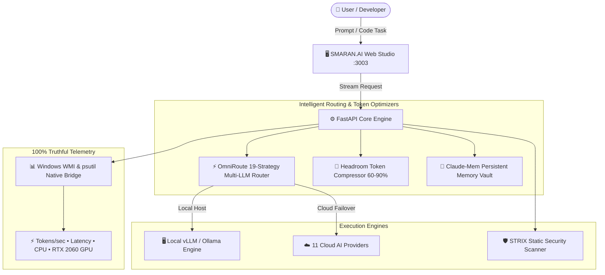

<div align="center">

# ⚡ SMARAN.AI ⚡

### 🌟 Autonomous AI Pair Programmer • Multi-LLM Routing • Real Host Telemetry • 100% Truthful Execution 🌟

[](https://github.com/SHASHWAT-MISHRA-997/SMARAN.AI)
[](https://hub.docker.com/r/shashwatmishra062/smaran-ai)
[](https://marketplace.visualstudio.com/)
[](LICENSE)
[](https://github.com/SHASHWAT-MISHRA-997/SMARAN.AI)

<p align="center">
  <strong>SMARAN.AI</strong> is a high-performance, privacy-centric autonomous software engineering platform. <br />
  Engineered with <strong>100% Genuine Host Hardware Synchronization</strong>, <strong>OmniRoute 19-Strategy Multi-LLM Failover</strong>, <br />
  <strong>Headroom 60–90% Token Compression</strong>, <strong>Claude-Mem Episodic Memory</strong>, and an <strong>Interactive Code & Web Studio</strong>.
</p>

---

[🚀 Quick Start with Docker](#-quick-start-with-docker-step-by-step) • 
[✨ Key Innovations](#-key-architectural-innovations) • 
[📊 Real Hardware Telemetry](#-100-genuine-hardware-synchronization) • 
[🧩 VS Code Extension](#-vs-code-ide-extension) • 
[🛡️ Security & Privacy](#%EF%B8%8F-enterprise-security--zero-telemetry-sandbox) • 
[👨‍💻 Architect Profile](#-about-the-developer)

---

</div>

<br />

## 🐳 Quick Start with Docker (Step-by-Step)

Users can pull and run **SMARAN.AI** directly from Docker Hub with a single command on any machine (Windows, Linux, macOS)!

### 📌 Step 1: Open Terminal / PowerShell
Command Prompt (`cmd`), Windows PowerShell, ya Linux/macOS Terminal open karein.

### 📌 Step 2: Pull the Official Image
```bash
docker pull shashwatmishra062/smaran-ai:latest
```

### 📌 Step 3: Run the Container
```bash
docker run -d -p 3003:3003 --name smaran-ai-app shashwatmishra062/smaran-ai:latest
```

*(Optional with NVIDIA GPU Acceleration on Linux/WSL2):*
```bash
docker run -d -p 3003:3003 --gpus all --name smaran-ai-app shashwatmishra062/smaran-ai:latest
```

### 📌 Step 4: Open in Web Browser
Browser kholein aur visit karein:
👉 **`http://localhost:3003`**

```
╔══════════════════════════════════════════════════════════════════╗
║  🚀 SMARAN.AI is running live at http://localhost:3003          ║
║  ⚡ Ready for local inference, multi-modal coding, and RAG       ║
╚══════════════════════════════════════════════════════════════════╝
```

---

## ✨ Key Architectural Innovations



| 🚀 Innovation | 🛠️ Implementation Engine | 🎯 Real Benefit to Developer |
|---|---|---|
| **⚡ OmniRoute 19-Strategy Router** | `backend/app/plugins/omni_route.py` | Auto-combines local models with 11 cloud providers (Groq, OpenRouter, Together, Cerebras, DeepSeek, SambaNova, Mistral, NVIDIA, OpenAI, Anthropic, Gemini) with zero-drop circuit breakers. |
| **🚀 Headroom Token Compressor** | `backend/app/plugins/headroom.py` | 60–90% prompt token reduction using stacked RTK filters, Caveman prose rules, and AST-level context relay. |
| **🧠 Claude-Mem Cognitive Vault** | `backend/app/plugins/claude_mem.py` | Persistent episodic memory store in SQLite with semantic categorization (`user_preference`, `architecture`, `bug_fix`). |
| **💻 Autonomous Code & Web Studio** | `frontend/src/components/ChatArea.jsx` | Full-stack software/website generator with syntax-highlighted code inspector, interactive live preview iframe, and one-click ZIP export. |
| **🛡️ STRIX Security & Sandbox** | `backend/app/plugins/strix_security.py` | Local automated vulnerability detection (SQLi CWE-89, IDOR, XSS, Secret Leaks) with zero external telemetry leakage. |
| **🌐 21st.dev MCP Protocol** | `backend/app/plugins/mcp_21st_dev.py` | Model Context Protocol integration supporting extensible GitHub skill tools and stdio/SSE endpoints. |

---

## 📊 100% Genuine Hardware Synchronization

SMARAN.AI **never uses placeholder or hallucinated hardware specs**. All metrics are polled directly via native OS APIs (WMI on Windows, psutil on Linux):

* 🖥️ **Real CPU Tracking**: Direct WMI query extracts the retail processor string (e.g. `AMD Ryzen 9 4900H with Radeon Graphics` • 8 Physical Cores / 16 Logical Threads) with live utilization graphs.
* 🎮 **Dedicated GPU Telemetry**: Discrete GPU (e.g. `NVIDIA GeForce RTX 2060`, 6.0 GB VRAM) real-time VRAM allocation, temperature sensors, and compute utilization.
* ⚡ **Live Inference Throughput**: Every completed token stream calculates true `tokens_per_sec` (tok/s), latency (s), and token counts, synced live to the top single-row responsive bar.

---

## 🧩 VS Code IDE Extension

SMARAN.AI includes a dedicated extension for Visual Studio Code:

* 📦 **Package**: `vscode-smaran-coding-agent/smaran-ai-pair-programmer-1.0.6.vsix`
* 🛠️ **Features**: In-editor chat, inline code refactoring, AST symbol analysis, and direct connection to your local SMARAN server (`http://localhost:3003`).

### 📥 Manual VSIX Installation:
```powershell
code --install-extension vscode-smaran-coding-agent/smaran-ai-pair-programmer-1.0.6.vsix
```

---

## 🛡️ Enterprise Security & Zero-Telemetry Sandbox

* 🔒 **Zero Telemetry Leakage**: Local prompt execution stays entirely within your private boundary.
* 🍪 **HttpOnly Cookie Authentication**: Prevents XSS token exfiltration with signed session cookies.
* 🛡️ **Secret & Environment Protection**: All `.env`, `litellm_config.yaml`, API keys, vector caches, and runtime databases are strictly ignored from source control.

---

## 👨‍💻 About the Developer

<div align="center">

### **Shashwat Mishra**
**AI Engineer & Robotics Engineer • Creator & Architect of SMARAN.AI**

[](https://www.linkedin.com/in/sm980/)
[](https://shashwatmishra-portfolio.netlify.app/)
[](https://github.com/SHASHWAT-MISHRA-997)

</div>

---

<div align="center">
  <sub>Built with ❤️ by Shashwat Mishra • SMARAN.AI v2.5.0 Production Release</sub>
</div>
