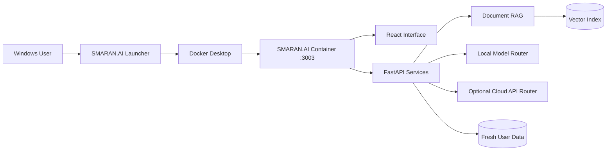

<div align="center">

# SMARAN.AI

### Local Intelligence. Cloud Freedom. One Private Workspace.

[](https://github.com/SHASHWAT-MISHRA-997/SMARAN.AI)
[](#system-requirements)
[](https://hub.docker.com/r/shashwatmishra062/smaran-ai)
[](#architecture)
[](#architecture)

**SMARAN.AI** is a Windows-first AI workspace for private document intelligence, local model execution, optional cloud API models, live web research, YouTube analysis, persistent memory, and real system telemetry.

[Features](#highlights) | [Quick Start](#quick-start) | [Architecture](#architecture) | [Privacy](#privacy-and-security) | [Developer](#developer)

</div>

---

## Highlights

| Capability | What it provides |
|---|---|
| Local AI | Run supported local models on compatible NVIDIA hardware |
| Cloud API models | Bring your own provider key and select an available provider model |
| Clear routing | The AI Engine header reports whether Local or Cloud API execution is active |
| Free-only protection | OpenRouter routes are filtered to verified zero-cost options where supported |
| Document RAG | Upload and query PDF, DOCX, XLSX, CSV, PPTX, text, code, and supported image files |
| Multi-source analysis | Use multiple uploaded documents, websites, or YouTube links in one request |
| YouTube intelligence | Embedded previews plus transcript and metadata-based analysis |
| Live web mode | Research URLs and current web content when explicitly enabled |
| AI memory | Store and manage approved persistent user context |
| Real telemetry | Display device CPU, memory, storage, network, GPU, temperature, and VRAM when available |
| Multilingual responses | English and major Indian-language response options |
| Appearance | Light, dark, or system theme with configurable left/right navigation |
| Windows launcher | A single executable starts the required Docker application and opens localhost |

## Model routing you can verify

SMARAN.AI does not silently rename one backend model as another.

- The header shows **Local** or **Cloud API**, provider, and selected model.
- Each completed response records the model identifier returned by the execution path.
- Cloud API execution does not present local GPU utilization as provider-side utilization.
- Provider model lists are fetched using the user's configured API key.
- Automatic free-route fallback is optional and limited to configured eligible routes.
- Direct OpenAI, Anthropic, and Gemini BYOK routes are user-selected and are not assumed to be free.

> Provider availability, free quotas, rate limits, and model access are controlled by each provider and may change.

## Quick Start

### Recommended: Windows release

1. Obtain `SMARAN_AI_Setup_v1.0.0.zip` from the developer.
2. Extract the archive to a folder you control.
3. Run `SMARAN.AI.exe`.
4. Allow the launcher to verify Docker Desktop and start the application.
5. Open `http://localhost:3003`.

The public release ZIP contains the executable only. Source files, developer databases, API keys, uploaded documents, and developer runtime history are not included.

### Developer deployment

```powershell
git clone https://github.com/SHASHWAT-MISHRA-997/SMARAN.AI.git
cd SMARAN.AI
docker compose up -d --build
```

Open:

```text
http://localhost:3003
```

Check health:

```powershell
docker compose ps
```

Expected application mapping:

```text
localhost:3003 -> smaran-ai:3003
```

## Architecture



### Technology

- React and Vite user interface
- FastAPI application services
- Docker Compose deployment
- vLLM-compatible local inference
- SQLite application storage
- Chroma-based vector retrieval
- Hybrid semantic and keyword document search

## Supported workflows

### Direct AI

Use the selected local or cloud model without document retrieval.

### Document RAG

Upload supported files, choose the relevant collection, and ask grounded questions. Uploaded items remain visible in the collection manager.

### Live web

Enable Web mode for current web pages, supported URLs, and multi-link requests.

### Provider API keys

The Model Hub supports provider-specific key entry and live model discovery. The exact visible model list depends on the provider account, region, quota, and current provider API response.

## System requirements

| Component | Minimum | Recommended |
|---|---|---|
| Operating system | Windows 10 64-bit | Windows 11 64-bit |
| Memory | 8 GB for cloud-oriented use | 16 GB or more |
| Storage | Space for Docker and selected models | SSD with 30 GB or more free |
| Docker | Docker Desktop | Current Docker Desktop release |
| Local GPU | Optional for cloud-only mode | NVIDIA GPU with suitable VRAM |
| Internet | Provider APIs and image download | Stable broadband |

Local model compatibility depends on model size, quantization, available RAM/VRAM, GPU support, and free disk capacity.

## Privacy and security

- `.env` is excluded from Git.
- Runtime databases, uploads, vector indexes, caches, logs, ZIP archives, and large binaries are excluded from source control.
- API keys are not documented or committed in this repository.
- Each fresh user deployment initializes its own runtime data.
- Cloud requests are sent only when the user selects and configures a cloud provider.
- The Docker Hub application image is maintained as a private repository.

Never commit real credentials. Use `.env.example` only as a configuration template.

## Project structure

```text
SMARAN.AI/
|-- backend/                 FastAPI, RAG, routing, telemetry
|-- frontend/                React interface
|-- Dockerfile               Production application image
|-- docker-compose.yml       Single application stack on port 3003
|-- launcher.py              Windows launcher source
|-- installer.iss            Windows installer definition
|-- push_image.bat           Developer image publishing helper
|-- .env.example             Safe configuration template
|-- .gitignore               Secret and runtime-data exclusions
`-- README.md
```

## Release information

- Application version: **1.0.0**
- Windows archive: `SMARAN_AI_Setup_v1.0.0.zip`
- Docker tags: `app-v1.0.0` and `latest`
- Application URL: `http://localhost:3003`

## Developer

<div align="center">

### Shashwat Mishra

**AI and Robotics Engineer | Creator and Architect of SMARAN.AI**

[](https://www.linkedin.com/in/sm980/)
[](https://shashwatmishra-portfolio.netlify.app/)
[](https://github.com/SHASHWAT-MISHRA-997)

</div>

---

<div align="center">

**SMARAN.AI v1.0.0**  
Built for transparent, controllable, and private AI workflows on Windows.

</div>

