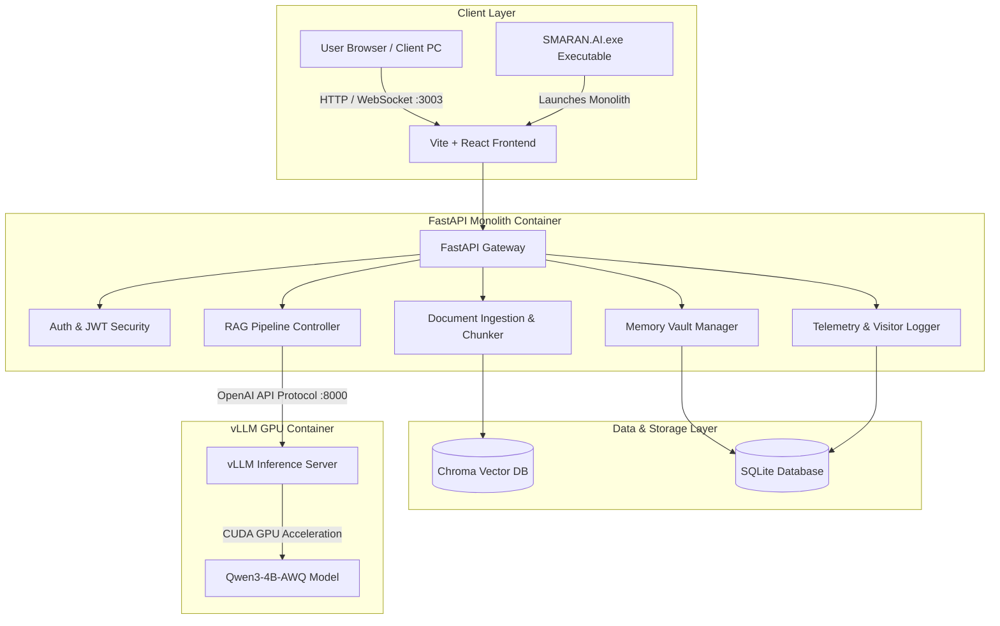
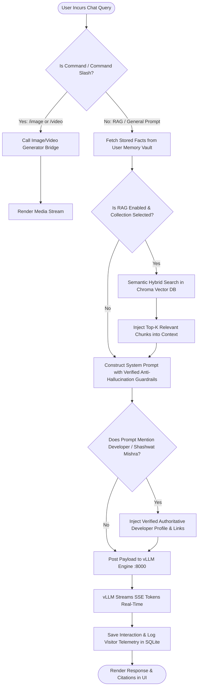
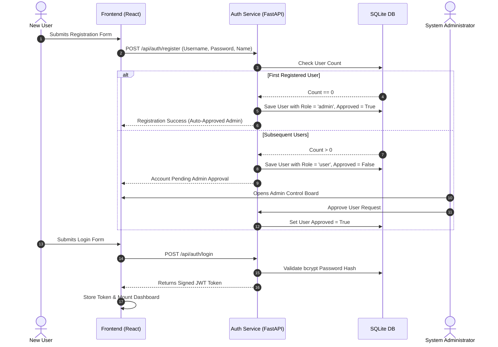

# 🧠 SMARAN AI — Enterprise Knowledge & High-Performance RAG Intelligence Console

[](https://github.com/SHASHWAT-MISHRA-997/SMARAN.AI)
[](https://hub.docker.com/r/shashwatmishra062/smaran-ai)
[](LICENSE)
[](https://vllm.ai)
[](https://shashwatmishra-portfolio.netlify.app/)

**SMARAN AI** is a state-of-the-art, air-gapped, on-premise Enterprise Document & RAG Intelligence Console developed for high-security robotics, engineering, and manufacturing organizations. It runs quantization-accelerated LLMs locally on GPU infrastructure to index, extract, search, and reason over proprietary enterprise knowledge without ever sending data to external cloud services.

---

## 🌟 Core Features & Highlights

- **⚡ High-Speed Local LLM Engine**: Powered by **vLLM** and **Qwen3-4B-AWQ (4-bit AWQ Quantized)** running on local CUDA GPUs with an expanded **8192-token context window**.
- **🔍 Multimodal RAG & Document Intelligence**: Deep text, table, and optical vision extraction for PDFs, DOCX, XLSX/Excel, PPTX, CSV, Invoices, Engineering Bills of Materials (BOMs), and raw source code.
- **🧠 AI Memory Vault**: Automatic real-time extraction and persistent storage of user preferences, roles, project contexts, and key facts across all chat sessions.
- **🛡️ Strict Grounding & Anti-Hallucination Guardrails**: Enforces exact factual document citations. If source documents do not contain the answer, the engine refrains from inventing facts.
- **📊 Developer Telemetry & Analytics Dashboard**: Restricted real-time tracking of visitor log metrics, active sessions, prompt throughput, and system resource utilization (RAM, GPU VRAM, DB size).
- **🖥️ Standalone Windows Portable Launcher**: Includes `SMARAN.AI.exe` for one-click startup without requiring manual environment setup.
- **🔒 Role-Based Access Control (RBAC)**: Secure user registration, password hashing (bcrypt), JWT authentication, master password recovery, and administrator account approval.

---

## 🏗️ System Architecture



---

## 🔄 RAG Execution & Search Flowchart



---

## 🔐 User Lifecycle & Access Control Flowchart



---

## 💻 Hardware Requirements

| Component | Minimum Specifications | Recommended Specifications |
|-----------|------------------------|----------------------------|
| **OS** | Windows 10/11, Ubuntu 22.04 LTS, macOS (Docker) | Windows 11 / Linux (CUDA Supported) |
| **CPU** | Intel Core i5 (10th Gen) / AMD Ryzen 5 | Intel Core i7 / AMD Ryzen 7 or higher |
| **RAM** | 16 GB DDR4 | 32 GB DDR4/DDR5 |
| **GPU** | NVIDIA GTX 1660 / RTX 2060 (6 GB VRAM) | NVIDIA RTX 3060 / 4070+ (8 GB+ VRAM) |
| **CUDA** | CUDA 11.8+ / Driver v530+ | CUDA 12.0+ / Driver v550+ |
| **Storage** | 20 GB SSD Space | 50 GB High-Speed NVMe SSD |

---

## 🚀 Quick Start Guide

### Option 1: One-Click Standalone Executable (Windows)

1. Download `SMARAN_AI_Universal_Release.zip` or clone the repository.
2. Extract the ZIP package to your desired directory.
3. Double-click **`SMARAN.AI.exe`**.
4. The launcher automatically starts the backend server, launches the web interface, and opens your default browser at `http://localhost:3003`.

---

### Option 2: Production Docker Compose (Recommended for Teams)

1. Clone the repository:
   ```bash
   git clone https://github.com/SHASHWAT-MISHRA-997/SMARAN.AI.git
   cd SMARAN.AI
   ```

2. Start all services using Docker Compose:
   ```bash
   docker compose up -d
   ```

3. Open your browser and navigate to:
   ```text
   http://localhost:3003
   ```

4. Check container statuses:
   ```bash
   docker compose ps
   ```

---

### Option 3: Manual Developer Setup (Source Code)

#### Backend Setup (FastAPI):
```bash
cd backend
python -m venv venv
# Windows:
.\venv\Scripts\activate
# Linux/macOS:
source venv/bin/activate

pip install -r requirements.txt
uvicorn app.main:app --host 0.0.0.0 --port 3003 --reload
```

#### Frontend Setup (React + Vite):
```bash
cd frontend
npm install
npm run dev
```

---

## 🌐 LAN Network Deployment (Multi-Device Office Use)

To share **SMARAN AI** across your office network so team members can access it from their own PCs/laptops:

1. Obtain the host computer's IPv4 address:
   ```powershell
   ipconfig
   # Example Output: 192.168.1.100
   ```

2. Open port `3003` in Windows Firewall (run PowerShell as Administrator):
   ```powershell
   New-NetFirewallRule -DisplayName "SMARAN AI LAN Access" -Direction Inbound -Action Allow -Protocol TCP -LocalPort 3003 -Profile Private
   ```

3. Share the LAN link with your team:
   ```text
   http://192.168.1.100:3003
   ```

---

## 📁 Repository Structure

```text
SMARAN.AI/
├── backend/
│   ├── app/
│   │   ├── auth.py             # JWT & Password Security Handlers
│   │   ├── config.py           # Application Settings & Defaults
│   │   ├── database.py         # SQLAlchemy SQLite Connection
│   │   ├── main.py             # FastAPI Core Routing & Chat Stream Engine
│   │   ├── models.py           # Database Schemas (User, Memory, VisitorLog)
│   │   ├── models_catalog.py   # AI Models Catalog & Quantization Configs
│   │   ├── schemas.py          # Pydantic Request/Response Models
│   │   ├── telemetry.py        # Host & GPU Resource Monitors
│   │   ├── utils.py            # Helpers & Zep Memory Bridges
│   │   ├── vision.py           # Multimodal Vision OCR Engine
│   │   └── rag/                # Document Chunking, Embedding & Search Pipelines
│   ├── Dockerfile              # Backend Container Build Spec
│   └── requirements.txt        # Python Dependencies
├── frontend/
│   ├── src/
│   │   ├── components/         # React Components (Chat, Admin, Settings, Memory)
│   │   ├── App.jsx             # Main Application Router & State
│   │   └── index.css           # Global Dark Theme Styling & Glassmorphism
│   ├── package.json            # Node Dependencies
│   └── vite.config.js          # Vite Build Configuration
├── docker-compose.yml          # Production Docker Compose Services
├── launcher.py                 # Standalone Windows GUI Executable Entrypoint
├── SMARAN.AI.exe               # Pre-compiled Standalone Executable
├── SMARAN_AI_Universal_Release.zip # Universal Distribution Release Package
└── README.md                   # System Documentation
```

---

## 👨‍💻 Developer & Author Credits

| Lead Developer & Architect | Official Links |
|----------------------------|----------------|
| **SHASHWAT MISHRA** <br> *AI & Robotics Engineer \| MTech Graduate* | 🔗 [LinkedIn Profile](https://www.linkedin.com/in/sm980/) <br> 🌐 [Portfolio Website](https://shashwatmishra-portfolio.netlify.app/) |

> **Creator & Architect of**: SMARAN AI — Enterprise Knowledge & RAG Intelligence Console.

---

## 📄 License

This project is licensed under the MIT License — see the [LICENSE](LICENSE) file for details.
